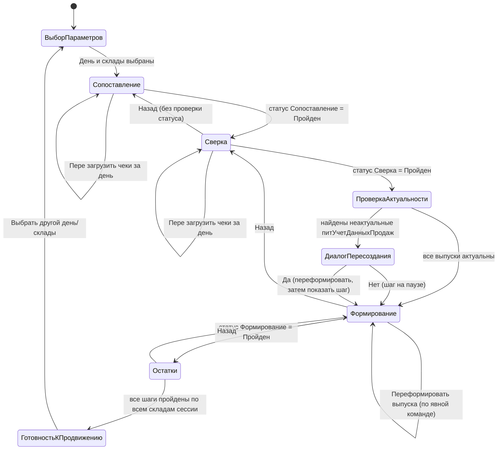
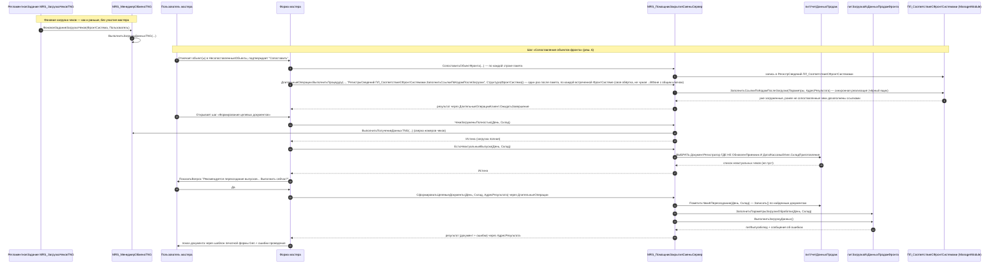

# Design: Помощник закрытия смены (`mrs-shift-closing-assistant`)

Статус: Фаза C (design), после pre-finalization gate. `proposal.md` и delta-спеки в `specs/*/spec.md` — зафиксированы, здесь не пересматриваются по существу. Этот документ отвечает на вопрос «КАК», а не «ЧТО».

## Discovered Patterns and Conventions

Ниже — факты, извлечённые прямым чтением кода расширения `MRS_ЗакрытиеСмены` (наш репозиторий) и файлов-референсов базовой конфигурации/модуля «Общепит», скопированных пользователем в репозиторий для чтения (полный перечень — `## Context sources`).

1. **Текущий MVP не имеет понятия «шаг».** `DataProcessors/MRS_АРМ_Закрытия_смены/Forms/Форма/Ext/Form/Module.bsl` — одна плоская форма: кнопки «Загрузить данные», «Сформировать отчёт сверки», «Сформировать ведомость», «Сформировать анализ» вызывают соответствующие процедуры `Ext/ObjectModule.bsl` напрямую, без блокировок перехода и без сохранения статуса.
2. **`ВыполнитьЗагрузкуДанных()` на `DataProcessors.питЗагрузкаИзДанныхПродажФронта` — экспортная функция без параметров**, работающая через заполненные реквизиты объекта (`Организация`, `КассовыйУзел`, `ДатаНачалаОтбора`, `ДатаКонцаОтбора`, `ДатаЦелевыхДокументов`, `ГруппироватьПоНомеруСмены`, `ПереходящаяСмена`, `ДнейВпередДляАнализаПерехода`, `ДнейНазадДляАнализаПерехода`, `РазрешитьНедовложения`, ТЧ `ПараметрыКасс`). Единственный существующий вызов — интерактивный, из `Forms/Форма/Ext/Form/Module.bsl`, процедура `ВыполнитьЗагрузку()`; дефолты реквизитов заданы в форме (`Инициализация()`), а не в `ObjectModule` — значит, программный вызов извне формы обязан САМ воспроизвести эти дефолты (`ДатаЦелевыхДокументов=1`, `ГруппироватьПоНомеруСмены=Истина`, `ПереходящаяСмена=Истина`, `ДнейВпередДляАнализаПерехода=1`, `ДнейНазадДляАнализаПерехода=1`).
3. **Точка входа регламентной загрузки чеков — процедура-обработчик фонового задания, а не сам алгоритм загрузки.** `CommonModules/MRS_МенеджерОбменаTNG/Ext/Module.bsl`: `ЗапускЗагрузкиЧековTNGВФоне()` (Экспорт, без параметров) вызывает `ФоновыеЗадания.Выполнить("MRS_МенеджерОбменаTNG.ФоновоеЗаданиеЗагрузкаЧеков", ..., Метаданные.РегламентныеЗадания.MRS_ЗагрузкаЧековTNG.Ключ, ...)`. `ФоновоеЗаданиеЗагрузкаЧеков(ФронтСистема, Пользователь)` вычисляет период через `ПолучитьДатыЗапрета` и, если есть, что грузить, вызывает `ВыполнитьЗагрузкуДанныхTNG(ФронтСистема, НачалоПериода, КонецПериода, , 0)` — глубокую процедуру с алгоритмом Oracle-выгрузки, маппинга полей и `СдвинутьДатуЗапрета`. Симметрично для Micros (`ЗапускЗагрузкиЧековMICROSВФоне`/`ФоновоеЗаданиеЗагрузкаЧеков`/`ВыполнитьЗагрузкуДанныхMicros`).
4. **Отдельная экспортная функция для сверочных данных уже существует и уже используется отчётом-образцом.** `Reports/MRS_ПродажиФронтСистем/Ext/ObjectModule.bsl` (единственная процедура `ПриКомпоновкеРезультата`) вызывает `MRS_МенеджерОбменаTNG.ВыполнитьПолучениеДанныхTNG()` — экспортную функцию, которая делает live-запрос к Oracle фронта и джойнит результат с `Документ.питДанныеПродажФронта.Товары`, возвращая построчную таблицу с колонками и по фронту (`СУММАТОВАРА`, `СУММАСКИДКИ`, ...), и по 1С (`СуммаДокументаЧекОбщепита`, `СуммаЧекОбщепита`, ...). Симметричная функция `MRS_МенеджерОбменаMicros.ВыполнитьПолучениеДанныхMicros(ФронтСистема, НачалоПериода, КонецПериода, ПараметрыКасс, НомерЧека)` подтверждена тем же чтением кода. Это ГОТОВЫЙ источник данных для шага «Сверка чеков» — не нужно писать собственный запрос к живому Oracle.
5. **Регистр `ПЛ_СоответствиеСФронтСистемами` (модуль «Общепит», референс) имеет собственный менеджер-модуль с готовыми экспортными точками**, релевантными для проектирования формы сопоставления:
   - `ДобавитьЗаписьДляСопоставления(ТипОбъекта, ТипФронтСистемы, Код, Наименование)` — создаёт «пустую» (несопоставленную, `Объект` не заполнен) запись-плейсхолдер, если такой ещё нет. Именно так во время загрузки чека появляются несопоставленные строки, которые видит наш новый мастер.
   - `ЗаполнитьСсылкиПоКодамПослеЗагрузкиВФоне(ФронтСистема, ИдентификаторФормы)` (готовая асинхронная обёртка) / `ЗаполнитьСсылкиПоКодамПослеЗагрузки(Параметры, АдресРезультата)` (синхронная реализация) — постобработка: `ОбработатьЧеки(ФронтСистема)` (прочитана целиком, 590+ строк) фильтрует чеки `ГДЕ НЕ СтатусыОбработкиЧеков.СопоставлениеЗавершено И НЕ Чек.ПометкаУдаления И Чек.Дата > КОНЕЦПЕРИОДА(ДатаЗапретаИзменения.ДатаЗапрета, ДЕНЬ)` (соединение с `РегистрСведений.ПЛ_СтатусыОбработкиЧековОбщепита.СопоставлениеЗавершено`, измерение `ДокументЧек`) и подставляет `Объект` из сопоставлений по кодам. **Синхронная `ЗаполнитьСсылкиПоКодамПослеЗагрузки` — настоящая экспортная точка МЕНЕДЖЕРА РЕГИСТРА** — в отличие от процедур формы `ВозможностьЗагрузкиДПФ` (п.10 ниже — те нельзя вызвать программно), эту МОЖНО и НУЖНО вызывать напрямую; наш мастер вызывает её сам, сразу после `СопоставитьОбъектФронта(...)` на шаге «Сопоставление» (решение 6), но НЕ через готовую обёртку `...ВФоне` — та жёстко задаёт константный `КлючФоновогоЗадания`, общий для всех вызовов независимо от `ФронтСистема`, что создаёт риск конфликта при параллельных вызовах; вместо неё — своя обёртка через `ДлительныеОперации.ВыполнитьПроцедуру` (та же схема, что и для остальных долгих операций мастера, решение 5).
6. **Негативные остатки в MVP считаются простым запросом к `РегистрНакопления.ТоварыНаСкладах.ОстаткиИОбороты(...)`**, а `АнализДанных`/`ПостроительОтчетаАнализаДанных` в `MRS_АРМ_Закрытия_смены/Ext/ObjectModule.bsl` — это только слой вывода в табличный документ (сводная статистика), не часть бизнес-логики отбора. Для табличного списка на форме мастера этот слой избыточен — переиспользуется только запрос.
7. **Проверка прав по роли по имени уже используется в базовом коде (референс) через `MRS_Сервер.РольДоступнаВызовСервера("ИмяРоли")`** (`Documents/питВыпускБлюд/Ext/ObjectModule.bsl:714`). Модуль `MRS_Сервер` физически не включён в набор файлов-референсов — используется только как подтверждение существования паттерна проверки роли по имени; для новой повышенной роли проектируется штатный метаданных-уровня механизм (право `Удаление`), без зависимости от этого модуля.
8. **БСП `ДлительныеОперации`/`ДлительныеОперацииКлиент` подтверждены `ssl_search`** (см. `## Context sources`) и в этой фазе — точными сигнатурами через тот же `ssl_search` (`its_help`/`1C-docs-mcp` были недоступны из-за сетевой ошибки инструмента, оба вызова провалились; `ssl_search` — работоспособная альтернатива по той же категории документации «Базовая функциональность», решения ниже опираются на неё).
9. **Регион-конвенция общих модулей проекта** (`module-structure.mdc`): `#Область ПрограммныйИнтерфейс` (экспортные точки), `#Область СлужебныйПрограммныйИнтерфейс` (экспортные, но для внутреннего использования подсистемы), `#Область СлужебныеПроцедурыИФункции` (неэкспортные помощники). Используется для нового общего модуля.
10. **Существующий паттерн «пометить чеки к пересозданию приёмника» уже реализован — `питУчетДанныхПродаж`/`Forms/ВозможностьЗагрузкиДПФ`, оба `ObjectBelonging=Adopted`** (реально принадлежат расширению `MRS_ЗакрытиеСмены`, не референс модуля «Общепит»). `Forms/ВозможностьЗагрузкиДПФ/Ext/Form/Module.bsl`: `MRS_ОбновитьСписокНаСервере(ЭтоУстановкаВозможностиЗагрузки)` — запрос к `РегистрСведений.питУчетДанныхПродаж` (соединение с `Документ.питДанныеПродажФронта` по `ВидОперации = ...ДанныеПродажФронтаВозврат` для возвратов отдельной веткой ОБЪЕДИНИТЬ) находит `ДокументРегистратор`, где `ОбновленПриемник` не Истина, с фильтрами `Объект.Организация`/`Объект.КассовыйУзел` (через `УчетДанныхПродаж.ДокументРегистратор.КассаККМ.питКассовыйУзел`)/период (`ДатаНачалаОтбора`/`ДатаКонцаОтбора` на `УчетДанныхПродаж.ДокументРегистратор.Дата`)/`ДатаСмены`; `УстановитьВозможностьЗагрузкиНаСервере()` (Экспорт, вызывается командой формы) для каждого найденного документа делает `СтрокаДокумента.Документ.ПолучитьОбъект().Записать()` в `Попытка/Исключение`. Обе процедуры — приватные процедуры МОДУЛЯ ФОРМЫ (не общего модуля и не экспортная точка объекта регистра/обработки) — программно вызвать их из кода мастера НЕВОЗМОЖНО (1С не даёт вызывать процедуры чужой формы извне), поэтому мастер обязан реализовать ЭКВИВАЛЕНТНУЮ логику внутри СВОЕГО общего модуля, а не переиспользовать эти процедуры напрямую. Внутренняя механика того, что именно `Записать()` взводит внутри `питДанныеПродажФронта` (что помечает документ к переобработке приёмником) — не вычитана построчно, зафиксирована как чёрный ящик (см. `## Open Questions`/`proposal.md → Risks`).
11. **Маппинг «касса → склад приготовления» — персистентный реквизит УЗЛА ПЛАНА ОБМЕНА, не вычисляемое значение.** `DataProcessors/питЗагрузкаИзДанныхПродажФронта/Forms/Форма/Ext/Form/Module.bsl → СохранитьИзмененияКассовогоУзла`: `текКассовыйУзел = текСтрокаНастроек.КассаККМ.питКассовыйУзел` (т.е. `Справочник.КассыККМ` имеет реквизит `питКассовыйУзел` типа `ПланОбмена.питУдаленныеКассы`); `текКассовыйУзелОбъект = текКассовыйУзел.ПолучитьОбъект()`; далее `текКассовыйУзелОбъект.СкладПриготовления = ...` и `.Записать()` — то есть САМ узел плана обмена `питУдаленныеКассы` (тот же тип, что дименсия `КассовыйУзел` регистра `питУчетДанныхПродаж`, подтверждено `питУчетДанныхПродаж.xml`) хранит персистентный реквизит `СкладПриготовления` (`Справочник.Склады`, подтверждено `питЗагрузкаИзДанныхПродажФронта.xml → ПараметрыКасс.СкладПриготовления`, тот же тип). Это даёт прямой путь фильтрации записей `питУчетДанныхПродаж` по выбранным складам мастера: `питУчетДанныхПродаж.КассовыйУзел.СкладПриготовления` — без обращения к `ДокументРегистратор`. Остаточная неопределённость (не блокирующая, чёрный ящик): узел также хранит числовой реквизит `СпособОпределенияСкладаПриготовления` — существование нескольких «способов» намекает, что фактический склад приготовления для конкретного чека МОЖЕТ определяться обработкой `питЗагрузкаИзДанныхПродажФронта` динамически (не всегда буквально равен статичному `СкладПриготовления` узла); для целей ФИЛЬТРАЦИИ (не для самого формирования документов — там работает обработка как чёрный ящик) статичный реквизит узла — единственный источник, доступный без прямого чтения полного текста `ВыполнитьЗагрузкуДанных()`, и принимается как рабочее приближение с проверкой на реальной ИБ.

## Architectural Decision

### 1. Размещение и состав нового объекта(ов)-мастера

**Решение:** одна новая Обработка `MRS_ПомощникЗакрытияСмены` (финальное имя — рабочее имя из `proposal.md` признано удачным, других претендентов не появилось) с **одной формой** `Форма`. Внутри формы — двухуровневая структура групп страниц:
- верхний уровень: `СтраницаПараметров` (выбор дня + складов, показывается первой) → `СтраницаШагов`;
- внутри `СтраницаШагов` — вложенная группа страниц `ГруппаШагов` с `ОтображениеСтраниц = Мастер` (платформенный режим «Мастер», тот самый, что использует `ПомощникИсправленияОстатковТоваровОрганизаций` для скрытия заголовков вкладок и визуального «шага за шагом»), четыре дочерних страницы — по одной на домен (`smena-front-object-matching`, `smena-sales-reconciliation`, `smena-target-document-generation`, `smena-negative-stock-resolution`).

`DataProcessors/MRS_АРМ_Закрытия_смены` **не удаляется и не дорабатывается** (вне scope, `proposal.md → Retired objects`) — физически остаётся в конфигурации; из командного интерфейса/подсистем скрывается (`Видимость` в подсистеме = Ложь либо перенос в неиспользуемую подсистему), чтобы пользователи не обращались к ней (`specs/smena-shift-closing-workflow → Requirement: Замена текущей плоской обработки`). Конкретный механизм скрытия — стандартная задача `1c-metadata-manager` при реализации, не архитектурное решение.

**Альтернативы и почему отклонены:**
- *Командный интерфейс + отдельные формы на шаг* (открытие каждого шага как отдельного окна/формы обработки) — отклонено: усложняет передачу состояния (день+склады+статусы) между формами через параметры, требует отдельного «диспетчера окон», не даёт визуальной целостности мастера. Единая форма с вложенными страницами передаёт весь контекст через реквизиты формы без параметров окна.
- *Полностью автоматическая навигация платформенного режима «Мастер»* (использовать штатные кнопки «Далее»/«Назад», которые сам режим выводит) — отклонена в пользу **кастомных команд** `Далее`/`Назад`, потому что штатная навигация режима «Мастер» не умеет блокировать переход по вычисляемому статусу шага без дополнительной обвязки событий; кастомные команды дают точку для проверки статуса перед `Элементы.ГруппаШагов.ТекущаяСтраница = ...`. Визуальный режим «Мастер» (без заголовков вкладок) сохраняется для «шагового» ощущения интерфейса — платформенная фича не отбрасывается целиком, отбрасывается только автоматическая часть навигации.

### 2. Механизм навигации по шагам

**Решение:** состояние сессии — исключительно реквизиты формы, не персистентный объект:
- `ВыбранныйДень` (Дата);
- `СкладыСессии` (ТаблицаЗначений с колонками `Склад`/`Выбран` для мультивыбора на `СтраницаПараметров`, готовый результат выбора — служебный `Массив` в переменной формы, пересобирается из отмеченных строк при переходе со страницы параметров);
- индикатор текущего шага — сама `Элементы.ГруппаШагов.ТекущаяСтраница` (не дублируется отдельным числом);
- `СтатусыШагов` — ТаблицаЗначений (НомерШага, Наименование, Статус: «Пройден»/«НеПройден»/«Недоступен») — **пересчитывается заново на КАЖДОЕ активизации страницы** через обработчик события Pages `ГруппаШагов.ПриАктивизации` (`&НаКлиенте`, немедленно вызывающий `&НаСервере`-процедуру, которая обращается к `MRS_ПомощникЗакрытияСменыСервер.СтатусШагаX(...)`), а не кэшируется в форме дольше текущего открытия страницы.

Переход вперёд (`Далее`) на клиенте: получить статус ТЕКУЩЕГО шага с сервера → если «Пройден», переставить `ТекущаяСтраница` на следующую страницу группы → иначе показать предупреждение и остаться. Переход назад (`Назад`) — без проверки статуса (пройденный шаг открывается для повторной работы всегда, `specs/smena-shift-closing-workflow → Requirement: Жёсткая последовательность шагов, Scenario: Возврат к предыдущему шагу вручную`). Это прямо реализует требование «нет автоматического отката статуса»: сервер никогда сам не «откатывает» статус — статус просто вычисляется заново при каждом заходе, и если пользователь ничего не поменял, результат будет тот же «Пройден», что и раньше.

Рекомендуемый день (`РекомендуемыйДень`) вычисляется один раз при открытии `СтраницаПараметров` (после выбора складов) — см. `Component Design` ниже.

### 3. Модуль(и) вычисления статуса шага

**Решение: один общий модуль** `MRS_ПомощникЗакрытияСменыСервер` (Сервер = Истина, клиентские компиляции = Ложь) на весь мастер, с разбиением на регионы, а не N модулей по доменам.

**Обоснование:** масштаб мастера — 4 шага + сопутствующая оркестрация, оценочно 12-15 экспортных точек. `module-structure.mdc` предлагает регион-разделение (`ПрограммныйИнтерфейс`/`СлужебныйПрограммныйИнтерфейс`/`СлужебныеПроцедурыИФункции`) как штатный механизм структурирования внутри одного модуля — этого достаточно для навигации по коду такого объёма. Разбиение на модуль-на-домен добавило бы 4 модуля ради задачи, которая для каждого домена сводится к 1-3 функциям, и создало бы дублирование мелкой инфраструктуры (получение параметров сессии, форматирование результата). Если мастер вырастет (новые домены/шаги), разделение по регионам уже готово к физическому разнесению без переписывания сигнатур.

**Клиент-серверная граница:** ни одна функция общего модуля не вызывается с клиента напрямую — только через `&НаСервере`-процедуры формы (стандартный паттерн проекта: 16 подтверждённых вызовов БСП `ОбщегоНазначения*` в существующем `MRS_АРМ_Закрытия_смены` идут по той же схеме форма→сервер→общий модуль). Долгие операции (сверка через живой Oracle, переформирование выпусков, пересчёт рекомендуемого дня) запускаются через `&НаСервере`-функции, возвращающие структуру `ДлительнаяОперация` (см. решение 5), и ожидаются `&НаКлиенте` через `ДлительныеОперацииКлиент.ОжидатьЗавершение`.

### 4. Проверка актуальности выпусков и интерактивное (пере)формирование целевых документов на шаге «Формирование целевых документов»

**Решение (полностью заменяет отменённую механику «хук в `ФоновоеЗаданиеЗагрузкаЧеков`»):** никакого автозапуска и никаких правок в `MRS_МенеджерОбменаTNG`/`MRS_МенеджерОбменаMicros`. Вся оркестрация — новый код в общем модуле мастера, вызываемый ИНТЕРАКТИВНО из формы: при входе на шаг «Формирование целевых документов» и по явной команде «Переформировать выпуска». Переиспользуется не сама форма-референс `Forms/ВозможностьЗагрузкиДПФ` (её процедуры — приватные процедуры модуля ЧУЖОЙ формы, вызвать их из кода мастера нельзя, см. `Discovered Patterns` п.10), а её ЗАПРОСНЫЙ ПАТТЕРН, перенесённый в новую пару экспортных функций общего модуля мастера, ограниченную строго выбранными день+склады (а не организацией/кассовым узлом/произвольным периодом, как у формы-референса).

Шаг «Формирование целевых документов» — складо-специфичный (`proposal.md → Flows`, п.9: «формирование документов и анализ остатков — по каждому складу»); все процедуры этого решения принимают ОДИН текущий склад (`ТекущийСклад`, реквизит формы, решение 2/Implementation Map), не массив складов сессии — что напрямую подтверждено сценариями `specs/smena-target-document-generation/spec.md` (везде фигурирует один склад, например «Кухня-1»).

**Шаг 1 — предусловие полноты загрузки чеков за день.** Прежде чем показывать что-либо про актуальность выпусков, `MRS_ПомощникЗакрытияСменыСервер.ЧекиЗагруженыПолностью(День, Склад)` сравнивает множество чеков фронта за день (номера чеков, полученные `MRS_МенеджерОбменаTNG.ВыполнитьПолучениеДанныхTNG(...)`/`MRS_МенеджерОбменаMicros.ВыполнитьПолучениеДанныхMicros(...)` — тот же чёрный ящик, что уже используется шагом «Сверка чеков», решение 7) с множеством чеков, реально загруженных в `Документ.питДанныеПродажФронта` за тот же день/склад. Если во фронт-выборке есть номера чеков, отсутствующие среди загруженных, — загрузка НЕ полная: шаг показывает предупреждение, ни диалог актуальности, ни команда «Переформировать выпуска» недоступны (`specs/smena-target-document-generation → Requirement: Предусловие полноты загрузки чеков за день`). Точный критерий зафиксирован как дефолт — см. `## Open Questions`, п.1 (не подтверждён отдельным полем «день закрыт на фронте» — такого поля в прочитанных объектах не найдено).

**Шаг 2 — проверка актуальности (при входе на шаг).** Если загрузка полная, `MRS_ПомощникЗакрытияСменыСервер.ЕстьНеактуальныеВыпуски(День, Склад)` выполняет запрос к `РегистрСведений.питУчетДанныхПродаж`:
```
ВЫБРАТЬ РАЗЛИЧНЫЕ
    УчетДанныхПродаж.ДокументРегистратор КАК Документ
ИЗ
    РегистрСведений.питУчетДанныхПродаж КАК УчетДанныхПродаж
ГДЕ
    УчетДанныхПродаж.Дата = &ВыбранныйДень
    И УчетДанныхПродаж.КассовыйУзел.СкладПриготовления = &Склад
    И НЕ УчетДанныхПродаж.ОбновленПриемник
```
(фильтр по складу — через персистентный реквизит узла `КассовыйУзел.СкладПриготовления`, факт подтверждён кодом, см. `Discovered Patterns` п.11; фильтр по дню — через собственную дименсию регистра `Дата`, без обращения к `ДокументРегистратор.Дата`). Если результат не пуст — форма (`&НаКлиенте`) показывает `ПоказатьВопрос` с текстом «Рекомендуется пересоздание выпусков блюд для обновления. Выполнить сейчас?» (Да/Нет), как того требует `specs/smena-target-document-generation → Requirement: Проверка актуальности выпусков...`.
- **«Нет»** — шаг остаётся не пройден («на паузе»), никаких действий на сервере не выполняется, пользователь может продолжать работу с другими шагами/склад-днями.
- **«Да»** — вызывается ТО ЖЕ действие, что команда «Переформировать выпуска» (шаг 3 ниже), программно, без повторного открытия диалога.

**Шаг 3 — действие «Переформировать выпуска» (доступно и по явной команде, независимо от диалога).** Реализуется в общем модуле как `MRS_ПомощникЗакрытияСменыСервер.СформироватьЦелевыеДокументы(День, Склад, АдресРезультата)` — процедура-обёртка под `ДлительныеОперации.ВыполнитьПроцедуру` (решение 5, без изменений в самом БСП-механизме):
1. `ПометитьЧекиКПересозданию(День, Склад)` — служебная функция, воспроизводящая ЗАПРОС из `MRS_ОбновитьСписокНаСервере`/`УстановитьВозможностьЗагрузкиНаСервере` (`Forms/ВозможностьЗагрузкиДПФ`, см. `Discovered Patterns` п.10), но с отбором `УчетДанныхПродаж.Дата = &ВыбранныйДень` и `УчетДанныхПродаж.КассовыйУзел.СкладПриготовления = &Склад` вместо периода/организации/кассового узла формы-референса; для каждого найденного `ДокументРегистратор` с `ОбновленПриемник ≠ Истина` — `СтрокаДокумента.Документ.ПолучитьОбъект().Записать()` в `Попытка/Исключение` (тот же паттерн «пустая перезапись взводит пересоздание приёмника» — внутренний механизм остаётся чёрным ящиком, `proposal.md → Risks`). Ветка про чеки-возвраты (`ВидОперации = ...ДанныеПродажФронтаВозврат`) из формы-референса переносится без изменений — те же чеки-возвраты подпадают под тот же фильтр день+склад.
2. `ЗаполнитьПараметрыЗагрузкиОбработки(Обработка, День, Склад)` — служебная функция, воспроизводящая дефолты формы `питЗагрузкаИзДанныхПродажФронта/Forms/Форма` (`Discovered Patterns` п.2: `ДатаЦелевыхДокументов=1`, `ГруппироватьПоНомеруСмены=Истина`, `ПереходящаяСмена=Истина`, `ДнейВпередДляАнализаПерехода=1`, `ДнейНазадДляАнализаПерехода=1`) и ограничивающая `ДатаНачалаОтбора=ДатаКонцаОтбора=День`; табличная часть `ПараметрыКасс` заполняется ТОЛЬКО кассами, чей `питКассовыйУзел.СкладПриготовления = Склад` (запрос по `Справочник.КассыККМ` с соединением на реквизит узла) — это и есть требуемое пользователем ограничение «строго по выбранному складу», а не по всей организации, как у формы-референса.
3. `Обработка.ВыполнитьЗагрузкуДанных()` — вызов чёрного ящика без изменений (решение 5/9), возвращает созданный/обновлённый `питВыпускБлюд` и сообщения об ошибках.
4. Результат (документ + `ПолучитьСообщенияПользователю(Истина)`) кладётся в `АдресРезультата` (Хранилище значения) — `ДлительныеОперацииКлиент.ОжидатьЗавершение` на клиенте читает результат и открывает документ через существующий шаблон печатной формы обработки `питЗагрузкаИзДанныхПродажФронта` (чёрный ящик, файл шаблона вне репозитория, со слов пользователя), показывая ошибки проведения рядом.

**Почему НЕ переиспускается сама форма `ВозможностьЗагрузкиДПФ` программно (например, `ПолучитьФорму` + вызов через `ОповеститьОВыполнении`).** Три довода: (а) её серверные процедуры — процедуры МОДУЛЯ ФОРМЫ, а не общего/менеджера-модуля — платформа не даёт вызвать процедуру произвольной чужой формы напрямую, только через открытие формы целиком и передачу параметров/команд, что для серверной пакетной операции избыточно и хрупко (зависимость от чужого UI, который может измениться в модуле «Общепит»); (б) форма-референс фильтрует по организации/кассовому узлу/периоду — привязки «строго к выбранным день+склады» там нет и её пришлось бы эмулировать снаружи те же условия, что проще сделать напрямую в своём запросе; (в) `питУчетДанныхПродаж`/`ВозможностьЗагрузкиДПФ` — `Adopted`-объекты РАСШИРЕНИЯ `MRS_ЗакрытиеСмены` (то есть физически принадлежат этому же расширению, не модулю «Общепит») — значит, копирование их запросного паттерна в общий модуль мастера того же расширения не создаёт зависимости от чужого кода, это внутреннее переиспользование в границах одного расширения.

**Права доступа на запись `питДанныеПродажФронта`/вызов `ВыполнитьЗагрузкуДанных()`.** Форма-референс `ВозможностьЗагрузкиДПФ` уже выполняет `ДокументОбъект.Записать()` интерактивно, от имени текущего пользователя, без явного включения привилегированного режима в прочитанном коде формы — то есть у пользователя, которому доступна эта форма, прав достаточно без привилегированного режима. Мастер выполняет ТУ ЖЕ операцию (перезапись `питДанныеПродажФронта` + вызов `ВыполнитьЗагрузкуДанных()`) от имени пользователя мастера. Не подтверждено чтением ролей в этой сессии, требуется зафиксировать как факт для проверки на реальной ИБ (не выдумывается): входит ли право на `Изменение`/`Чтение` этих объектов уже в состав ролей, которыми на практике наделяется «ответственный за склад» (базовая роль «Общепит»/ERP), или требует дополнительной роли сверх `MRS_УдалениеВыпускаБлюд` (решение 8, которая покрывает только `Удаление` на `питВыпускБлюд`, не эти объекты).

**Отклонённые альтернативы:**
- *Хук в `ФоновоеЗаданиеЗагрузкаЧеков` (прежнее решение)* — отменено пользователем: нарушает `proposal.md → Non-goals` при более строгой (актуальной) трактовке, не даёт пользователю контроля/видимости момента запуска, не совместимо с требованием явного диалога подтверждения и предусловием полноты загрузки (в момент завершения фонового задания «за день» может быть загружена лишь часть — просто ПОСЛЕДНИЙ вызов регламентного задания, а не гарантированно весь день).
- *Вызов процедур формы `ВозможностьЗагрузкиДПФ` через программное открытие формы* — отклонено, см. три довода выше.
- *Полный автозапуск без диалога подтверждения при входе на шаг* — отклонено: прямо противоречит `specs/smena-target-document-generation → Requirement: Проверка актуальности...`, которая явно требует запрос подтверждения, а не тихий запуск.

### 5. Подсистемы БСП

**Решение:** `ДлительныеОперации`/`ДлительныеОперацииКлиент`, современный API `ВыполнитьПроцедуру`/`ОжидатьЗавершение` (а не устаревший `ВыполнитьВФоне`, который сама документация БСП помечает как «вместо этой функции рекомендуется использовать `ВыполнитьФункцию`/`ВыполнитьПроцедуру`»). Подтверждённые сигнатуры (`ssl_search`, категория «Базовая функциональность»):

```
Функция ВыполнитьПроцедуру(Знач ПараметрыВыполнения = Неопределено, ИмяПроцедуры,
    Знач Параметр1 = Неопределено, ..., Знач Параметр7 = Неопределено) Экспорт
```
— в отличие от `ВыполнитьВФоне`, не требует, чтобы вызываемая процедура имела фиксированную сигнатуру `(Параметры, АдресРезультата)`: подходит произвольная процедура с 0-7 параметрами, что снимает необходимость писать процедуры-обёртки специально под фоновый вызов.

Используется для четырёх интерактивных операций мастера:
1. **`(Пере)загрузить чеки за день`** (шаги «Сопоставление»/«Сверка») — `&НаСервере`-функция формы вызывает `ДлительныеОперации.ВыполнитьПроцедуру(ПараметрыВыполнения, "MRS_ПомощникЗакрытияСменыСервер.ПерезагрузитьЧекиЗаДень", ВыбранныйДень)`; `&НаКлиенте` подключает `ДлительныеОперацииКлиент.ОжидатьЗавершение` с текстом «Перезагрузка чеков за выбранный день...».
2. **`Переформировать выпуска`** (шаг «Формирование целевых документов») — аналогично, `"MRS_ПомощникЗакрытияСменыСервер.СформироватьЦелевыеДокументы"`, параметры `(ВыбранныйДень, ТекущийСклад, АдресРезультата)` (решение 4). Один и тот же вызов используется и по явной команде «Переформировать выпуска», и программно из ветки «Да» диалога подтверждения актуальности (решение 4) — без дублирования логики.
3. **Вычисление рекомендуемого дня** при открытии `СтраницаПараметров` — потенциально дорогой скан по многим дням/складам; тот же паттерн `ВыполнитьПроцедуру` + `ОжидатьЗавершение`, текст ожидания «Поиск рекомендуемого дня...».
4. **Пропагация сопоставления на уже загруженные чеки** (шаг «Сопоставление», после `СопоставитьОбъектФронта(...)`, решение 6) — `ДлительныеОперации.ВыполнитьПроцедуру(ПараметрыВыполнения, "РегистрыСведений.ПЛ_СоответствиеСФронтСистемами.ЗаполнитьСсылкиПоКодамПослеЗагрузки", Новый Структура("ФронтСистема", ФронтСистема))` — та же схема (СВОЯ асинхронная обёртка вокруг чужой СИНХРОННОЙ реализации), но с ЧУЖИМ именем процедуры (менеджер регистра, не общий модуль мастера), поэтому `ИмяПроцедуры` указывает на `РегистрыСведений...`, а не на `MRS_ПомощникЗакрытияСменыСервер...`; выбрана именно эта схема, а не переиспользование готовой обёртки `ЗаполнитьСсылкиПоКодамПослеЗагрузкиВФоне`, потому что та жёстко задаёт константный `КлючФоновогоЗадания` без привязки к `ФронтСистема`/сессии — общий ключ на параллельные вызовы (TNG/Micros, разные сессии мастера); `ВыполнитьПроцедуру` генерирует уникальные параметры выполнения на каждый вызов, конфликта нет (подробности — решение 6).

Пересчёт статуса шага при обычной навигации (переход между уже открытыми страницами) — НЕ оборачивается в `ДлительныеОперации`: это должен быть быстрый точечный запрос по конкретному дню+складам (не полный скан истории), выполняется синхронно в `&НаСервере`; если на реальных объёмах это окажется медленным — тема отдельной оптимизации (`proposal.md → Risks`, вне решения этого design.md, см. `## Open Questions`).

Других специализированных БСП-подсистем (навигация по мастерам, специальный API для «шаговых» форм) `ssl_search` не подтвердил (см. `proposal.md → Context sources`) — платформенный режим страниц «Мастер» (решение 1) закрывает эту потребность без БСП.

### 6. Форма сопоставления объектов фронта

**Решение:** НЕ отдельная метаданных-Форма, заимствованная на объекте `РегистрСведений.ПЛ_СоответствиеСФронтСистемами` — вместо этого UI встраивается как страница `СтраницаСопоставление` внутри `ГруппаШагов` самой обработки `MRS_ПомощникЗакрытияСмены`. На странице — одна `ТаблицаЗначений` (реквизит формы `НесопоставленныеОбъекты`, не связанная напрямую с регистром) с колонками: `ТипОбъекта` (представление — «Касса»/«Номенклатура»), `ФронтСистема`, `Код`, `НаименованиеНаФронте`, `ОбъектДляСопоставления` (ссылочное поле ввода, тип определяется по строке — `Справочник.КассыККМ` или `Справочник.Номенклатура`). Командная панель строки: `Сопоставить` (`&НаКлиенте` → `&НаСервере`, если `ОбъектДляСопоставления` заполнен — вызывает `MRS_ПомощникЗакрытияСменыСервер.СопоставитьОбъектФронта(ТипОбъекта, ФронтСистема, Код, ОбъектДляСопоставления)`, удаляет строку из таблицы при успехе).

Таблица наполняется запросом (в `СтатусШагаСопоставление`): все записи `РегистрСведений.ПЛ_СоответствиеСФронтСистемами`, встреченные в чеках выбранного дня (через `ПЛ_КодКнопки`/`ПЛ_КодТочкиПродажи` на строках `питДанныеПродажФронта`, отфильтрованных по дате и присутствующих во фронт-системах сессии), у которых `Объект` не заполнен — ЛЕВОЕ соединение аналогично запросу в референсном `ManagerModule.bsl` (`ОбработатьЧеки`), но БЕЗ его побочных эффектов (никакого изменения документов чеков — только `SELECT`).

**Почему НЕ отдельная Форма-заимствование объекта.** Три довода:
1. `ПЛ_СоответствиеСФронтСистемами` — объект модуля «Общепит» (Rarus/базовая конфигурация), физически не индексированный в этом репозитории; добровольное «заимствование» объекта только ради новой формы требует, чтобы объект поддерживал расширяемость форм (`РасширениеОбъекта`/`ИспользованиеРасширений`) — этот факт не подтверждён ни одним доступным инструментом (граф метаданных не индексирует модуль «Общепит», ITS/докс-МCP недоступны в этой сессии из-за сетевой ошибки). Встраивание страницы внутрь СОБСТВЕННОЙ обработки расширения не зависит от этого факта вовсе.
2. Функционально форме регистра не нужно ничего, кроме чтения (запрос) и точечной записи через менеджер записи набора — оба действия делаются напрямую запросом/`СоздатьНаборЗаписей()`, без необходимости открывать форму этого регистра как отдельный UI-объект.
3. Держит весь новый UI мастера в границах ОДНОЙ новой метаданных-Обработки — проще для ревью, разработки и (в будущем) удаления/переноса, чем распределение по двум объектам разных подсистем.

Функция записи соответствия — НЕ переиспользует `ДобавитьЗаписьДляСопоставления` (та создаёт пустой плейсхолдер, что нам не нужно — плейсхолдер уже существует к моменту показа списка); вместо этого:
```
Функция СопоставитьОбъектФронта(ТипОбъекта, ФронтСистема, Код, Объект) Экспорт
    НаборЗаписей = РегистрыСведений.ПЛ_СоответствиеСФронтСистемами.СоздатьНаборЗаписей();
    НаборЗаписей.Отбор.ТипОбъекта.Установить(ТипОбъекта);
    НаборЗаписей.Отбор.ФронтСистема.Установить(ФронтСистема);
    НаборЗаписей.Отбор.Код.Установить(Код);
    НаборЗаписей.Прочитать();
    Если НаборЗаписей.Количество() = 0 Тогда
        НоваяЗапись = НаборЗаписей.Добавить();
        НоваяЗапись.ТипОбъекта = ТипОбъекта;
        НоваяЗапись.ФронтСистема = ФронтСистема;
        НоваяЗапись.Код = Код;
    Иначе
        НоваяЗапись = НаборЗаписей[0];
    КонецЕсли;
    НоваяЗапись.Объект = Объект;
    НаборЗаписей.Записать();
    Возврат Истина;
КонецФункции
```
(структура записи и наименование полей — по составу регистра, подтверждённому в `proposal.md → ## Metadata`: измерения `ТипОбъекта`/`ФронтСистема`/`Код`, ресурс `Объект`; `Количество`/`Упаковка`/`НоменклатураАлкоголь` из формы записи не заполняются мастером — эти поля релевантны для типа «Номенклатура» с фасовкой/алкоголем и требуют отдельного мини-диалога, не входящего в MVP этого шага; см. `## Open Questions`).

**Пропагация сопоставления на уже загруженные чеки — закрытый факт, не гипотеза.** `InformationRegisters/ПЛ_СоответствиеСФронтСистемами/Ext/ManagerModule.bsl` содержит НАСТОЯЩУЮ экспортную точку МЕНЕДЖЕРА РЕГИСТРА (в отличие от процедур формы `ВозможностьЗагрузкиДПФ`, `Discovered Patterns` п.10 — те нельзя вызвать программно, эту МОЖНО и НУЖНО): синхронная процедура `ЗаполнитьСсылкиПоКодамПослеЗагрузки(Параметры, АдресРезультата) Экспорт` (принимает `Параметры` = Структура с опциональным свойством `ФронтСистема`) вызывает внутреннюю `ОбработатьЧеки(ФронтСистема)`, которая фильтрует `ГДЕ НЕ СтатусыОбработкиЧеков.СопоставлениеЗавершено И НЕ Чек.ПометкаУдаления И Чек.Дата > КОНЕЦПЕРИОДА(ДатаЗапретаИзменения.ДатаЗапрета, ДЕНЬ)` (соединение с `РегистрСведений.ПЛ_СтатусыОбработкиЧековОбщепита.СопоставлениеЗавершено`, измерение `ДокументЧек`) — то есть строго только чеки, где сопоставление ещё НЕ завершено, не удалённые, после даты запрета. Параметра «день/период» у функции нет и не требуется — этот фильтр уже естественно ограничивает объём обработки; добавлять свой день-скоуп поверх избыточно и невозможно без переписывания 590-строчного запроса `ОбработатьЧеки` (что нарушило бы принцип «чёрный ящик»).

**Почему НЕ переиспользуется готовая обёртка `ЗаполнитьСсылкиПоКодамПослеЗагрузкиВФоне(ФронтСистема, ИдентификаторФормы)`.** Эта функция того же менеджера регистра внутри себя жёстко задаёт `ПараметрыВыполнения.КлючФоновогоЗадания = "ЗаполнитьСсылкиПоКодамПослеЗагрузки"` — константную строку, без привязки к конкретной `ФронтСистема` или к вызывающей сессии. Если мастер вызовет эту обёртку для TNG и для Micros почти одновременно (или из двух параллельных сессий мастера — сценарий не исключён: несколько пользователей закрывают разные дни/склады одновременно), оба вызова используют ОДИН и тот же ключ фонового задания — потенциальный конфликт при повторном запуске с уже занятым ключом (поведение `ДлительныеОперации.ВыполнитьВФоне` в этом случае — чужой БСП-код, не гарантировано). Устаревший `ВыполнитьВФоне` сам по себе также не рекомендуется документацией БСП (решение 5).

**Решение:** НЕ вызывать чужую готовую `...ВФоне`-обёртку — вместо этого вызывать чужую СИНХРОННУЮ реализацию `ЗаполнитьСсылкиПоКодамПослеЗагрузки` под СВОЕЙ собственной асинхронной обёрткой, по той же схеме, что уже используется в решении 5 для остальных трёх интерактивных операций мастера (`ДлительныеОперации.ВыполнитьПроцедуру`, который сам генерирует уникальные параметры выполнения на каждый вызов — общего захардкоженного ключа не возникает). Командный обработчик `Сопоставить` (или его серверная процедура) СРАЗУ после успешного `СопоставитьОбъектФронта(...)` (запись в регистр подтверждена) вызывает:
```
ДлительныеОперации.ВыполнитьПроцедуру(ПараметрыВыполнения,
    "РегистрыСведений.ПЛ_СоответствиеСФронтСистемами.ЗаполнитьСсылкиПоКодамПослеЗагрузки",
    Новый Структура("ФронтСистема", ФронтСистема))
```
где `ФронтСистема` берётся из колонки `ФронтСистема` строки таблицы `НесопоставленныеОбъекты`, которая только что была сопоставлена. `&НаКлиенте` подключает `ДлительныеОперацииКлиент.ОжидатьЗавершение` на результат этого вызова (та же клиентская обёртка БСП, что и для остальных долгих операций мастера, решение 5) — с текстом ожидания «Обновление ссылок в загруженных чеках...». Это полностью снимает риск общего ключа фонового задания без единой правки в самом менеджере регистра (чужой код не трогаем — используется только его синхронная реализация, не хардкод-обёртка вокруг неё).

- **Пакетное сопоставление — один вызов на пакет, не на строку.** Если пользователь отмечает несколько строк `НесопоставленныеОбъекты` и подтверждает их одним действием (например, командой «Сопоставить отмеченные»), `ДлительныеОперации.ВыполнитьПроцедуру(..., "...ЗаполнитьСсылкиПоКодамПослеЗагрузки", ...)` вызывается ОДИН раз ПОСЛЕ того, как весь пакет записан в `ПЛ_СоответствиеСФронтСистемами` — не на каждую отдельную запись, чтобы избежать N избыточных вызовов на одно действие пользователя.
- **Несколько фронт-систем в одном пакете.** Синхронная процедура принимает ровно одну `ФронтСистема` за вызов через параметр `Параметры.ФронтСистема` (или без него — тогда обрабатывает все). Если сопоставляемые в одном пакете строки относятся к разным фронт-системам (обычно одна, но не гарантировано — `specs/smena-front-object-matching → Requirement: Единая точка сопоставления...` не исключает смешанный пакет), общий модуль мастера собирает МНОЖЕСТВО уникальных значений `ФронтСистема` из отмеченных строк и вызывает `ДлительныеОперации.ВыполнитьПроцедуру` отдельно по каждому найденному значению — каждый вызов получает свои, уникальные на этот конкретный запуск параметры выполнения от `ДлительныеОперации`, поэтому параллельные вызовы по разным `ФронтСистема` не конфликтуют между собой (в отличие от общего захардкоженного ключа готовой обёртки).

Это полностью закрывает прежний открытый вопрос про пропагацию сопоставления на уже загруженные чеки — подтверждённый факт кода, а не гипотеза, требующая проверки на тестовой ИБ (см. `## Open Questions`, вопрос снят); риск общего ключа фонового задания снят архитектурно тем же решением (использование `ВыполнитьПроцедуру` вместо `...ВФоне`), а не оставлен как отдельный неразрешённый риск.

### 7. «Сверка чеков» и «Сверка чеков и выпусков»

**Решение — два разных источника данных для двух разных доменов, оба существующие «чёрные ящики»:**

- **«Сверка чеков» (`smena-sales-reconciliation`)** — сравнение данных ФРОНТА (живой Oracle) с загруженными в 1С `питДанныеПродажФронта`. Источник — `MRS_МенеджерОбменаTNG.ВыполнитьПолучениеДанныхTNG(ФронтСистема, НачалоПериода, КонецПериода, , 0)` / `MRS_МенеджерОбменаMicros.ВыполнитьПолучениеДанныхMicros(...)` (см. `Discovered Patterns` п.4) — та самая функция, что уже питает отчёт `Reports/MRS_ПродажиФронтСистем`, вызывается напрямую как источник данных, БЕЗ обращения к самому отчёту/его СКД-макету (отчёт как UI выводится из использования, `proposal.md → Retired objects`; переиспользуется только функция-источник, что и разрешает `proposal.md → Assumptions`). Постобработка в `MRS_ПомощникЗакрытияСменыСервер.СтатусШагаСверка`: строки, где `ЧекОбщепита` не заполнен (пустая ссылка) — чек ещё не подгружен в 1С, ЭТО НЕ отклонение (`specs/smena-front-data-load → Requirement: Незакрытые на фронте чеки не считаются отдельной категорией отклонения`), пропускаются; строки, где заполнены оба и суммы (`СУММАТОВАРА` vs `СуммаЧекОбщепита`, скидки `СУММАСКИДКИ` vs `СуммаСкидкиЧекОбщепита`) не совпадают — отклонение. Категория «марка алкоголя не найдена в фискальной базе Micros» (`specs/smena-sales-reconciliation → Requirement: Отклонения по алкоголю и маркам`) определяется признаком строки `АлкогольнаяПродукция = Истина` И `MRS_ЗагрузкаЕГАИСФронт.ПолучитьАкцизнуюМаркуПоНомеруЧека(...)` не возвращает марку для этой строки чека — вызов существующей функции модуля «Общепит», без изменения её кода.
- **«Сверка чеков и выпусков» (`smena-target-document-generation`)** — сравнение `питДанныеПродажФронта` с проведёнными `питВыпускБлюд`, ПОСЛЕ формирования документов. Источник — собственный запрос (не переиспользование СКД `ПЛ_СверкаПродажСЧеками`, которая сравнивает с оборотами `РегистрНакопления.ВыручкаИСебестоимостьПродаж`, а не с `питВыпускБлюд` напрямую — сам ПРИНЦИП агрегации перенесён из неё, см. `proposal.md → Context sources`, п. «Алгоритм сверки чеков/выпусков подтверждён»):
  ```
  ВЫБРАТЬ
      Товары.Номенклатура КАК Номенклатура,
      ВЫБОР КОГДА Товары.Номенклатура.питПродажаПоСвободнойЦене
          ТОГДА NULL ИНАЧЕ Товары.Характеристика КОНЕЦ КАК Характеристика,
      Товары.Ссылка.Склад КАК Склад,
      СУММА(Товары.Количество) КАК КоличествоПоЧекам
  ПОМЕСТИТЬ ОжидаетсяПоЧекам
  ИЗ Документ.питДанныеПродажФронта.Товары КАК Товары
  ГДЕ Товары.Ссылка.Дата МЕЖДУ &НачалоДня И &КонецДня
      И Товары.Ссылка.Склад В (&МассивСкладов)
      И НЕ Товары.Ссылка.ПометкаУдаления
  СГРУППИРОВАТЬ ПО Товары.Номенклатура, ..., Товары.Ссылка.Склад
  -- аналогичный агрегат по питВыпускБлюд.Товары (Проведён=Истина), ПОЛНОЕ соединение по Номенклатура+Склад(+Характеристика)
  -- Разница = КоличествоПоВыпуску - КоличествоПоЧекам: <0 — блокирующая строка, >0 — информационная пометка
  ```
  Реализуется как один запрос с двумя временными таблицами + `ПОЛНОЕ СОЕДИНЕНИЕ`, без рецептурных коэффициентов (зафиксировано в спеке).

### 8. Новая повышенная роль на удаление `питВыпускБлюд`

**Решение:** новая роль расширения `MRS_УдалениеВыпускаБлюд`. Состав прав: ТОЛЬКО `Удаление = Истина` на объект `Документ.питВыпускБлюд` (Заимствованный объект расширения — `питВыпускБлюд` уже адаптирован в этом расширении, что подтверждено наличием собственных `#Вставка`-модификаций в `Ext/ObjectModule.bsl`, см. `Discovered Patterns` п.7 — то есть предоставление доп. права на него через роль расширения — штатный, уже используемый в проекте механизм адаптации, не новый паттерн). Никакие другие права (чтение/изменение/проведение) в этой роли не выставляются — они уже даёт базовая («ответственный») роль; права 1C складываются аддитивно по всем назначенным пользователю ролям, так что `MRS_УдалениеВыпускаБлюд` работает как ЧИСТАЯ надстройка, а не замена базовой роли.

**Альтернатива (роль-шаблон с параметризацией по объектам через RLS)** — отклонена: избыточна для единственного объекта и единственного права; `proposal.md → Non-goals` явно исключает ролевую модель по складам/точкам продаж, то есть ограничивать эту роль дополнительным RLS-условием не требуется — она либо есть у пользователя целиком, либо нет.

### 9. Разделение «чёрных ящиков»

Вызовы к базовой конфигурации/модулю «Общепит», используемые СТРОГО через подтверждённые публичные точки, без изменения их кода:

| Чёрный ящик | Точка | Использование в дизайне |
|---|---|---|
| `ОбщийМодуль.MRS_МенеджерОбменаTNG` | `ВыполнитьЗагрузкуДанныхTNG(...)`, `ВыполнитьПолучениеДанныхTNG(...)` | Ручная перезагрузка чеков (реш. 5), источник сверки (реш. 7), источник для предусловия полноты загрузки (реш. 4) |
| `ОбщийМодуль.MRS_МенеджерОбменаMicros` | `ВыполнитьЗагрузкуДанныхMicros(...)`, `ВыполнитьПолучениеДанныхMicros(...)` | То же, для Micros |
| `ОбщийМодуль.MRS_ЗагрузкаЕГАИСФронт` | `ПолучитьАкцизнуюМаркуПоНомеруЧека(...)` | Категоризация отклонений сверки по алкоголю (реш. 7) |
| `Обработка.питЗагрузкаИзДанныхПродажФронта` (ObjectModule) | `ВыполнитьЗагрузкуДанных()` | Формирование целевых документов — интерактивно, по диалогу подтверждения или по команде «Переформировать выпуска» (реш. 4/5) |
| `РегистрСведений.питУчетДанныхПродаж` + паттерн `Forms/ВозможностьЗагрузкиДПФ` (`MRS_ОбновитьСписокНаСервере`/`УстановитьВозможностьЗагрузкиНаСервере`) | запрос на неактуальные записи (`ОбновленПриемник ≠ Истина`) + перезапись `питДанныеПродажФронта` | Проверка актуальности выпусков и пометка чеков к пересозданию перед вызовом `ВыполнитьЗагрузкуДанных()` (реш. 4) — паттерн скопирован (не вызывается программно чужая форма), сам механизм «что взводит `Записать()`» — чёрный ящик |
| `РегистрСведений.ПЛ_СоответствиеСФронтСистемами` (Ext/ManagerModule.bsl) | `ЗаполнитьСсылкиПоКодамПослеЗагрузки(Параметры, АдресРезультата)` — СИНХРОННАЯ процедура, вызывается через СВОЙ `ДлительныеОперации.ВыполнитьПроцедуру(..., Новый Структура("ФронтСистема", ФронтСистема))` | Подтверждённая программная точка интеграции — вызывается СРАЗУ после `СопоставитьОбъектФронта(...)` на шаге «Сопоставление объектов фронта» (реш. 6), дозаполняет ссылки в уже загруженных, но ранее не сопоставленных чеках. Готовая асинхронная обёртка того же модуля `ЗаполнитьСсылкиПоКодамПослеЗагрузкиВФоне` **сознательно не используется** — она жёстко задаёт константный `КлючФоновогоЗадания` без привязки к `ФронтСистема`, что создаёт риск конфликта при параллельных вызовах (TNG/Micros, разные сессии мастера); своя обёртка через `ВыполнитьПроцедуру` генерирует уникальные параметры выполнения на каждый вызов |
| `Документ.питРецептура`, `Документ.питАктВскрытияТарыАлкогольнойПродукции`, `РегистрНакопления.питОстаткиМарокИС`, `РегистрНакопления.ТоварыНаСкладах` | только `ВЫБРАТЬ`-запросы (`.ОстаткиИОбороты`) | Отображение ошибок формирования и отрицательных остатков (шаги 3-4) — никаких `Записать()`/`Провести()` от лица мастера |

Все модификации мастера (запись `ПЛ_СоответствиеСФронтСистемами`, перезапись `питДанныеПродажФронта` по паттерну «пометка к пересозданию», роль на `питВыпускБлюд`) — на объектах, для которых `proposal.md`/спеки прямо предполагают новую точку записи/переиспользование существующего паттерна как часть этого change. `MRS_МенеджерОбменаTNG`/`MRS_МенеджерОбменаMicros` в этой редакции — **чистые чёрные ящики без единой изменённой строки**: решение 4 (прежде единственное точечное расширение поверх них) отменено и заменено интерактивной механикой, не требующей никаких правок в этих двух модулях.

## Component Design

| Компонент | Файл(ы) | Ответственность | Зависимости |
|---|---|---|---|
| `MRS_ПомощникЗакрытияСмены` (Обработка, новая) | `DataProcessors/MRS_ПомощникЗакрытияСмены.xml` + `Ext/ObjectModule.bsl` (минимальный, без бизнес-логики) | Точка входа мастера в командном интерфейсе | — |
| `Форма` (форма обработки, новая) | `DataProcessors/MRS_ПомощникЗакрытияСмены/Forms/Форма/**` | UI: выбор параметров, 4 страницы-шага, командные обработчики, клиент-серверные вызовы | `MRS_ПомощникЗакрытияСменыСервер` |
| `MRS_ПомощникЗакрытияСменыСервер` (Общий модуль, новый) | `CommonModules/MRS_ПомощникЗакрытияСменыСервер/Ext/Module.bsl` | Вычисление статусов шагов, оркестрация загрузки/формирования/сверки, запись сопоставлений, проверка актуальности выпусков через `питУчетДанныхПродаж` и пометка чеков к пересозданию (эквивалент `УстановитьВозможностьЗагрузкиНаСервере`, реш. 4) | `MRS_МенеджерОбменаTNG/Micros`, `MRS_ЗагрузкаЕГАИСФронт`, `питЗагрузкаИзДанныхПродажФронта`, `ПЛ_СоответствиеСФронтСистемами`, `питУчетДанныхПродаж`, БСП `ДлительныеОперации` |
| `MRS_УдалениеВыпускаБлюд` (Роль, новая) | `Roles/MRS_УдалениеВыпускаБлюд.xml` | Право `Удаление` на `Документ.питВыпускБлюд` | — |

## Implementation Map

1. **Обработка `MRS_ПомощникЗакрытияСмены`** — новый метаданных-объект расширения, без реквизитов объекта (весь стейт — в форме). Один Form `Форма`.
2. **Форма `Форма`:**
   - Реквизиты: `ВыбранныйДень` (Дата, состав даты — Дата), `РекомендуемыйДень` (Дата), `ТекущийСклад` (для складо-специфичных шагов 3/4, выбирается из отмеченных `СкладыСессии` табом/списком внутри страниц 3/4, если складов > 1), таблицы значений `СкладыВыбор` (Склад/Отмечен), `НесопоставленныеОбъекты`, `ОтклоненияСверки`, `ОшибкиФормирования`, `ДокументыОткрытыеЦены`, `ОтклоненияВыпуска`, `ОтрицательныеОстатки`, `СтатусыШагов`.
   - Элементы: `ГруппаОсновная` (страницы `СтраницаПараметров`/`СтраницаШагов`), внутри — `ГруппаШагов` (`ОтображениеСтраниц=Мастер`, 4 страницы), индикатор статусов (таблица/надпись сверху), панель готовности (`НадписьГотовность`).
   - Команды: `НачатьРаботу` (со `СтраницаПараметров` на `СтраницаШагов`), `Далее`, `Назад`, `Сопоставить` (командная панель таблицы `НесопоставленныеОбъекты`), `ПерезагрузитьЧекиЗаДень`, `ПереформироватьВыпуска`, `ОткрытьДокументВыпуска`, `ВыбратьДругойДень` (сброс на `СтраницаПараметров`).
3. **Общий модуль `MRS_ПомощникЗакрытияСменыСервер`:**
   - `#Область ПрограммныйИнтерфейс`: `РекомендуемыйДень(МассивСкладов)`, `СтатусШагаСопоставление(День, МассивСкладов)`, `СтатусШагаСверка(День, МассивСкладов)`, `СтатусШагаФормирование(День, Склад)`, `СтатусШагаОстатки(День, Склад)`, `СопоставитьОбъектФронта(ТипОбъекта, ФронтСистема, Код, Объект)`, `ПерезагрузитьЧекиЗаДень(День)`, `ЕстьНеактуальныеВыпуски(День, Склад)`, `СформироватьЦелевыеДокументы(День, Склад, АдресРезультата)`.
   - `#Область СлужебныйПрограммныйИнтерфейс`: `ПолучитьОтклоненияСверки(...)`, `ПолучитьОтклоненияВыпуска(...)`, `ПолучитьОтрицательныеОстатки(...)`, `ЧекиЗагруженыПолностью(День, Склад)` (реш. 4, предусловие), `ПометитьЧекиКПересозданию(День, Склад)` (реш. 4, эквивалент `УстановитьВозможностьЗагрузкиНаСервере`), `ЗаполнитьПараметрыЗагрузкиОбработки(Обработка, День, Склад)` (воспроизводит дефолты формы `питЗагрузкаИзДанныхПродажФронта`, см. `Discovered Patterns` п.2, ограничивает `ПараметрыКасс` кассами выбранного склада, см. решение 4).
   - `#Область СлужебныеПроцедурыИФункции`: построение временных таблиц запросов, вспомогательные преобразования.
4. **Роль `MRS_УдалениеВыпускаБлюд`** — новый метаданных-объект расширения, право `Удаление`=Истина на `Документ.питВыпускБлюд` (объект расширения указывается как заимствованный — `питВыпускБлюд` уже адаптирован).
5. **`DataProcessors/MRS_АРМ_Закрытия_смены`** — правка видимости в подсистеме/командном интерфейсе (скрытие), без правок кода.

### Визуальное оформление формы (детализация Решения 1)

Реализовано в `DataProcessors/MRS_ПомощникЗакрытияСмены/Forms/Форма/Ext/Form.xml`:

- `ГруппаШагов.PagesRepresentation = Wizard` — режим «Мастер» с кастомными кнопками `Далее`/`Назад`.
- Таблицы результатов анализа (`ОтклоненияСверки`, `ОтклоненияВыпуска`, `ОшибкиФормирования`, `ДокументыОткрытыеЦены`, `ОтрицательныеОстатки`, `СтатусыШагов`) — `ReadOnly`, без автодобавления строк.
- `НесопоставленныеОбъекты` — редактируемы только колонки `Отмечен` и `ОбъектДляСопоставления`; остальные поля только для чтения.
- Условное оформление: статус «Пройден» — зелёный текст, «НеПройден» — красный; строки `ОтклоненияВыпуска` с `Блокирует=Истина` — красный фон (`style:ЕдиныйНалоговыйСчетКрасныйЦветФона`).
- Надписи «всё чисто» (`НадписьВсеЧисто*`) на каждой странице шага — видимы, когда соответствующая таблица пуста.
- `НадписьГотовность` — полужирный шрифт.
- Скрытие старой обработки: `DataProcessors/MRS_АРМ_Закрытия_смены` — `UseStandardCommands=false` (резервный вариант при отсутствии подсистемы в расширении).

`CommonModules/MRS_МенеджерОбменаTNG`/`MRS_МенеджерОбменаMicros` — **не затрагиваются ни одной строкой** (отменённое решение 4 полностью убрано из плана реализации).

## Data Flows

### Навигация по шагам (состояния формы)


```text
Diagram: Wizard step navigation (state)
  [*] -> ВыборПараметров
  ВыборПараметров -- День+склады выбраны --> Сопоставление
  Сопоставление -- статус=Пройден --> Сверка
  Сверка -- статус=Пройден --> ПроверкаАктуальности (при входе на Формирование)
  ПроверкаАктуальности -- найдены неактуальные питУчетДанныхПродаж --> ДиалогПересоздания (Да/Нет)
  ПроверкаАктуальности -- всё актуально --> Формирование
  ДиалогПересоздания -- Нет --> Формирование (шаг остаётся не пройден)
  ДиалогПересоздания -- Да --> Формирование (после программного переформирования)
  Формирование -- статус=Пройден --> Остатки
  Остатки -- все шаги/склады пройдены --> ГотовностьКПродвижению
  (на каждом шаге доступно: Назад -- без проверки статуса --> предыдущий шаг)
  Сопоставление/Сверка -- (Пере)загрузить чеки --> сам себе (пересчёт статуса)
  Формирование -- Переформировать выпуска (явная команда) --> сам себе (пересчёт статуса)
  ГотовностьКПродвижению -- выбрать другой день --> ВыборПараметров
```

### Поток данных: от загрузки чеков до анализа остатков


```text
Diagram: Checks (background, unchanged) -> matching propagation -> interactive generation from wizard (sequence)
  ScheduledJob(TNG) -> MRS_МенеджерОбменаTNG : ФоновоеЗаданиеЗагрузкаЧеков (без изменений в этом change)
  ---
  User -> WizardForm : шаг "Сопоставление объектов фронта" — отмечает и подтверждает объект(ы)
  WizardForm -> Orchestrator : СопоставитьОбъектФронта(...) по каждой строке пакета
  Orchestrator -> ПЛ_СоответствиеСФронтСистемами : запись в регистр
  WizardForm -> Orchestrator : ДлительныеОперации.ВыполнитьПроцедуру(..., "РегистрыСведений.ПЛ_СоответствиеСФронтСистемами.ЗаполнитьСсылкиПоКодамПослеЗагрузки", Структура(ФронтСистема)) — один раз после пакета, по каждой встреченной ФронтСистеме (своя обёртка вокруг чужой синхронной процедуры — не готовая ...ВФоне с общим захардкоженным ключом)
  Orchestrator -> WizardForm : результат через ДлительныеОперацииКлиент.ОжидатьЗавершение
  ---
  User -> WizardForm : открывает шаг "Формирование целевых документов"
  WizardForm -> Orchestrator : ЧекиЗагруженыПолностью(День, Склад)
  Orchestrator -> TNG/Micros : ВыполнитьПолучениеДанныхTNG/Micros (черный ящик, сверка номеров)
  WizardForm -> Orchestrator : ЕстьНеактуальныеВыпуски(День, Склад)
  Orchestrator -> питУчетДанныхПродаж : запрос ОбновленПриемник=Ложь по Дата+КассовыйУзел.СкладПриготовления
  WizardForm -> User : ПоказатьВопрос "Выполнить сейчас?" (Да/Нет)
  User -- Да --> WizardForm
  WizardForm -> Orchestrator : СформироватьЦелевыеДокументы (через ДлительныеОперации)
  Orchestrator -> питУчетДанныхПродаж : ПометитьЧекиКПересозданию (Записать() по найденным документам, паттерн из ВозможностьЗагрузкиДПФ)
  Orchestrator -> питЗагрузкаИзДанныхПродажФронта : ВыполнитьЗагрузкуДанных (черный ящик)
  Orchestrator -> WizardForm : документ + ошибки
  WizardForm -> User : шаблон печатной формы + ошибки проведения
```

## Build Sequence

1. Создать общий модуль `MRS_ПомощникЗакрытияСменыСервер` (пустые регионы, `syntaxcheck` на каркас).
2. Реализовать `СтатусШагаСопоставление`+`СопоставитьОбъектФронта` — минимальный вертикальный срез, проверяемый независимо от остальных шагов.
3. Реализовать `СтатусШагаСверка`+источники (`ВыполнитьПолучениеДанныхTNG`/`Micros`) — второй вертикальный срез.
4. Реализовать `ЧекиЗагруженыПолностью`+`ЕстьНеактуальныеВыпуски`+`ПометитьЧекиКПересозданию`+`ЗаполнитьПараметрыЗагрузкиОбработки`+`СформироватьЦелевыеДокументы`+`СтатусШагаФормирование` (включая предусловие полноты загрузки, проверку актуальности по `питУчетДанныхПродаж` и сверку чеков/выпусков, решение 4) — третий срез. Проверяется изолированным вызовом на тестовой ИБ (`MRS_ПомощникЗакрытияСменыСервер.СформироватьЦелевыеДокументы(...)` из консоли/обработчика, без открытия формы мастера), без каких-либо правок в `MRS_МенеджерОбменаTNG`/`MRS_МенеджерОбменаMicros`.
5. Реализовать `СтатусШагаОстатки` — простейший срез (переиспользует готовый запрос).
6. Создать Обработку `MRS_ПомощникЗакрытияСмены` и форму: сначала `СтраницаПараметров`+`РекомендуемыйДень`, затем `ГруппаШагов` (режим «Мастер») с 4 страницами, привязка к уже готовым сервисным функциям из шагов 2-5; на входе на страницу «Формирование» — вызов `ЕстьНеактуальныеВыпуски` и, если найдено, `ПоказатьВопрос` (Да/Нет) перед показом остального содержимого шага.
7. Подключить `ДлительныеОперации`/`ДлительныеОперацииКлиент` для трёх интерактивных операций (реш. 5).
8. Создать роль `MRS_УдалениеВыпускаБлюд`.
9. Скрыть `MRS_АРМ_Закрытия_смены` из командного интерфейса/подсистем.
10. Сквозная проверка: `syntaxcheck` → `check_1c_code` → `review_1c_code` по каждому изменённому/новому модулю; `verify_xml` для новых метаданных-объектов. `MRS_МенеджерОбменаTNG`/`MRS_МенеджерОбменаMicros` в этот шаг не входят — они не изменяются этим change.

## Critical Details

- **Обработка ошибок при формировании.** `питЗагрузкаИзДанныхПродажФронта.ВыполнитьЗагрузкуДанных()` — чёрный ящик; её результат/исключения не документированы в прочитанном коде построчно (в `ObjectModule.bsl` видна только сигнатура и общая оркестрация внутри, полный текст функции превышает лимит чтения инструмента и не был вычитан целиком). `MRS_ПомощникЗакрытияСменыСервер.СформироватьЦелевыеДокументы` (решение 4) вызывается ровно один раз на одну команду (один день+склад, инициировано пользователем — не циклом по организациям/складам), оборачивает вызов в `Попытка/Исключение`, логирует через `ЗаписьЖурналаРегистрации` при неожиданном исключении и в любом случае (успех/ошибка) возвращает результат в `АдресРезультата`, чтобы форма показала пользователю документ и/или ошибки проведения. Точная классификация ошибок (нехватка марок / нехватка ингредиентов / прочее, требуемая `specs/smena-target-document-generation → Requirement: Явный список ошибок формирования`) — по тексту `ОписаниеОшибки`/`СообщенияПользователю`, сформированным самой обработкой `питЗагрузкаИзДанныхПродажФронта` при её работе; реализация должна собирать `ПолучитьСообщенияПользователю(Истина)` сразу после вызова и классифицировать по ключевым словам/структуре (уточняется на этапе реализации по факту наблюдаемых сообщений — не может быть спроектировано вслепую без доступа к полному тексту чёрного ящика).
- **Состояние формы не персистентно.** При закрытии формы весь прогресс «забывается» намеренно (`proposal.md → Data & Integrations`) — при повторном открытии статусы вычисляются заново по актуальным данным, что автоматически синхронизирует форму с любыми внешними изменениями (в т.ч. сделанными не через мастер).
- **Производительность `РекомендуемыйДень`.** Скан потенциально многих дней — обёрнут в `ДлительныеОперации` (реш. 5), но сама реализация должна использовать пакетный запрос по диапазону дат (не цикл по дням с отдельным запросом на каждый) — конкретная граница диапазона (сколько дней сканировать) не зафиксирована `proposal.md` и оставлена как параметр реализации с разумным дефолтом (например, от максимальной `ДатыЗапретаИзменения` до текущей даты минус 1); если диапазон окажется практически неограниченным (очень старый неисправленный день) — тема отдельной оптимизации, не блокирует этот design.
- **Права доступа.** Обычная роль пользователя мастера не даёт `Удаление` на `питВыпускБлюд` — платформа сама блокирует интерактивное удаление; мастер не обязан дублировать эту проверку кодом (это стандартное поведение платформы для отсутствующего права, `specs/smena-target-document-generation → Scenario: Обычный пользователь не может удалить документ выпуска`).
- **Тестируемость решения 4.** Вся новая логика — обычные экспортные серверные функции нового общего модуля, вызываемые интерактивно из формы; тестируется прямым вызовом `MRS_ПомощникЗакрытияСменыСервер.СформироватьЦелевыеДокументы(День, Склад, АдресРезультата)`/`ЕстьНеактуальныеВыпуски(...)`/`ЧекиЗагруженыПолностью(...)` из консоли/обработчика на тестовой ИБ, без необходимости запускать реальные регламентные задания или готовить фоновый контекст — интерактивный вызов работает в обычной клиент-серверной сессии.
- **Контекст выполнения (не привилегированный).** Решение 4 выполняется полностью в интерактивном контексте текущего пользователя мастера — привилегированный режим не требуется по построению (нет фонового/регламентного контекста, для которого он был бы нужен). Форма-референс `Forms/ВозможностьЗагрузкиДПФ` уже выполняет аналогичную запись `питДанныеПродажФронта` интерактивно без включения привилегированного режима в прочитанном коде — это косвенно подтверждает, что базовых прав пользователя достаточно для этой операции. Прямое подтверждение через чтение состава ролей, фактически назначенных «ответственному за склад» на реальной ИБ (модуль «Общепит»/ERP роли вне этого репозитория), в этой сессии недоступно — зафиксировано как факт для проверки при внедрении, не выдумывается (см. `## Open Questions`).

## Open Questions

1. **Точный критерий «чеки за день загружены полностью» (предусловие решения 4) — дефолт зафиксирован, не подтверждён на реальных данных.** Ни один прочитанный объект (`питУчетДанныхПродаж`, `ПЛ_СтатусыОбработкиЧековОбщепита` — упомянут только в `proposal.md`, не прочитан) не даёт готового флага «за день N/склад M загружены ВСЕ чеки». **Принятый дефолт:** `MRS_ПомощникЗакрытияСменыСервер.ЧекиЗагруженыПолностью(День, Склад)` сравнивает множество номеров чеков, возвращаемое живым запросом к фронту (`MRS_МенеджерОбменаTNG.ВыполнитьПолучениеДанныхTNG(...)`/`MRS_МенеджерОбменаMicros.ВыполнитьПолучениеДанныхMicros(...)` — тот же источник, что уже используется шагом «Сверка чеков», решение 7) с множеством номеров чеков, реально загруженных в `питДанныеПродажФронта` за тот же день/склад; загрузка считается полной, если КАЖДЫЙ чек фронта присутствует среди загруженных (пустая разница). Риски дефолта: (а) если у фронт-системы на момент проверки чек ещё не закрыт (открытая смена на кассе) — он не будет виден и живому запросу тоже, то есть ложноположительная «полнота» возможна, если весь день на фронте физически не закрыт (частично устраняется тем, что и загрузка, и сверка одинаково не видят незакрытые чеки — так же, как в `specs/smena-front-data-load → Requirement`, где это НЕ считается отклонением); (б) сам запрос к фронту — синхронный вызов к живому Oracle, стоимость сопоставима с шагом «Сверка», отдельной оптимизации не требует. Уточняется на реальной ИБ; если обнаружится более точный источник (отдельный флаг «смена закрыта на фронте»), дефолт заменяется на реализации без пересмотра этого design.md.
2. **Права доступа на запись `питДанныеПродажФронта`/вызов `ВыполнитьЗагрузкуДанных()` сверх базовой роли — не подтверждено чтением ролей.** См. `Critical Details → Контекст выполнения`: рабочая гипотеза (базовых прав «ответственного» достаточно, привилегированный режим не нужен) обоснована по аналогии с `Forms/ВозможностьЗагрузкиДПФ`, но не подтверждена прямым чтением состава ролей модуля «Общепит»/ERP, назначаемых на практике. Проверяется на тестовой ИБ при реализации; если прав не хватает — оркестрация решения 4 добавляет `УстановитьПривилегированныйРежим(Истина)` на время своей работы (стандартный приём для нового кода общего модуля, не требует пересмотра архитектуры).
3. **Точная классификация ошибок формирования по тексту сообщений `питЗагрузкаИзДанныхПродажФронта`.** Полный текст `ObjectModule.bsl` этой обработки превышает лимит чтения инструмента (668666 символов) и не был вычитан целиком ни в этой, ни в предыдущей фазе — известна только сигнатура `ВыполнитьЗагрузкуДанных()` и общая оркестрация. Классификация ошибок на категории «нехватка марок/акта» / «нехватка ингредиентов» / «прочее» (`specs/smena-target-document-generation`) в этом design.md описана на уровне подхода (парсинг `ПолучитьСообщенияПользователю`), но точные тексты/структуры сообщений, которые реально генерирует эта обработка, не подтверждены построчным чтением — уточняется на этапе реализации по наблюдаемому поведению на тестовых данных.
4. **Граница диапазона сканирования для `РекомендуемыйДень`.** `proposal.md` не фиксирует горизонт (сколько дней в прошлое сканировать), см. `Critical Details`. Не блокирует реализацию (дефолт есть), но точный дефолт — предмет уточнения на реальных объёмах данных заказчика.
5. **Из `proposal.md → Open Questions` (перенесено без изменений, не переоткрывается):** интерактивные исправления отрицательных остатков внутри мастера — остаётся `report_only` в этой версии; вопрос про будущие интерактивные сценарии исправления не в scope `design.md`.

## Context sources

- `openspec/changes/mrs-shift-closing-assistant/proposal.md` — целиком, как утверждённый requirements-документ; все решения `## Metadata`/`## Assumptions`/`## Non-goals` приняты как локнутые входные данные.
- Все 6 delta-спек `openspec/changes/mrs-shift-closing-assistant/specs/*/spec.md` — прочитаны целиком, каждый `### Requirement:` учтён при проектировании соответствующего шага/компонента.
- `openspec/project.md` — подтверждает: расширение `MRS_ЗакрытиеСмены` (CFE), платформа 8.3.24, БСП не адаптирована внутри самого расширения (отдельного `СтандартныеПодсистемыСервер` в расширении нет — факт про расширение, не про весь проект, см. `proposal.md → Context sources`).
- **Прямое чтение кода расширения (это репозиторий, не референс):** `DataProcessors/MRS_АРМ_Закрытия_смены/**` (ObjectModule + Form.Module + xml); `CommonModules/MRS_МенеджерОбменаTNG/Ext/Module.bsl` (полностью, 1512 строк — точка `ФоновоеЗаданиеЗагрузкаЧеков`, `ВыполнитьЗагрузкуДанныхTNG`, `ВыполнитьПолучениеДанныхTNG`, `ЗаписатьДанныеДляСопоставления`); `CommonModules/MRS_МенеджерОбменаMicros/Ext/Module.bsl` (частично — первые 70 строк, симметричные точки входа подтверждены, полный текст не требовался); `DataProcessors/питЗагрузкаИзДанныхПродажФронта/Ext/ObjectModule.bsl` (частично, через `grep` по сигнатуре — файл превышает лимит чтения инструмента), `Ext/ManagerModule.bsl`, `Forms/Форма/Ext/Form/Module.bsl` (целиком — дефолты `Инициализация()`); `Reports/MRS_ПродажиФронтСистем/Ext/ObjectModule.bsl` (целиком, 29 строк — подтверждает переиспользование `ВыполнитьПолучениеДанныхTNG` как источника, не отчёта); `Roles/MRS_ОсновнаяРоль.xml` (стаб-роль).
- **Прямое чтение файлов-референсов базовой конфигурации/модуля «Общепит», добавленных пользователем в репозиторий:** `Documents/питВыпускБлюд.xml` + `Ext/ObjectModule.bsl` (частично, целевой grep по праву/роли — строка 714, `MRS_Сервер.РольДоступнаВызовСервера`); `Documents/питРецептура.xml`; `Documents/питАктВскрытияТарыАлкогольнойПродукции.xml`; `AccumulationRegisters/питОстаткиМарокИС.xml`; `InformationRegisters/ПЛ_СоответствиеСФронтСистемами.xml` + `Ext/RecordSetModule.bsl` + `Ext/ManagerModule.bsl` (целиком, 729 строк — новое открытие: `ДобавитьЗаписьДляСопоставления`, `ЗаполнитьСсылкиПоКодамПослеЗагрузки[ВФоне]`, не зафиксированное в `proposal.md`) + `Forms/ФормаЗаписи/Ext/Form/Module.bsl`.
- **БСП `ДлительныеОперации`/`ДлительныеОперацииКлиент` — сигнатуры подтверждены `ssl_search` (`1c-ssl-mcp`) в этой фазе**, категория «Базовая функциональность»: `ВыполнитьПроцедуру`, `ВыполнитьВФоне` (устаревшая, документация сама указывает предпочитать `ВыполнитьФункцию`/`ВыполнитьПроцедуру`), `ПараметрыВыполненияВФоне`/`ПараметрыВыполненияПроцедуры`, `ОжидатьЗавершение`, `ПараметрыОжидания`, `НовыйРезультатДлительнойОперации`, `НовоеСостояниеДлительнойОперации`, `ВыполнитьПроцедуруВНесколькоПотоков`/`ВыполнитьФункциюВНесколькоПотоков` (многопоточные — не использованы, наши операции однопоточны по своей природе), `ПрочитатьПрогресс`. Инструменты `its_help` (`1c-code-check-mcp`) и `search_1c_documentation` были недоступны в этой сессии — обе попытки завершились сетевой ошибкой инструмента («peer closed connection without sending complete message body»); `ssl_search` покрыл тот же раздел документации БСП («Базовая функциональность» — общий для платформенных и БСП API раздел данного источника) без потери точности сигнатур.
- `.cursor/rules/sdd-integrations.mdc`, `.cursor/skills/mermaid-diagrams/SKILL.md` — правила оформления этого документа (pre-finalization gate, формат диаграмм).
- `.cursor/rules/module-structure.mdc` — регион-конвенция общего модуля (решение 3).

### Обновление этой фазы: отмена хука в TNG/Micros и новая механика решения 4

- **Прямая цитата пользователя, отменяющая прежнее решение 4** (хук в `ФоновоеЗаданиеЗагрузкаЧеков`): «Потом переходим на этап выпусков, программа видит что чеки перезагружены по регистру питУчетДанныхПродаж. не стоит галочка обновлен приемник. Пишем пользователю, рекомендуется пересоздание выпусков блюд для обновления. Выполнить сейчас? да/нет. если нет то пока на паузе, если да, тогда нужно запустить создание выпусков в фоне, но только с отбором по выбранным пользователем складам и дате. Важно еще что чеки могут быть загружены частично, а к созданию выпуска должны быть выбраны все за день. ...И выдаем ему как и обработка шаблон печатной формы, в него передается созданный документ выпуск и ошибки можно ему показать если есть при проведении». Эта цитата и сопутствующие факты уже перенесены пользователем в `proposal.md`/`specs/smena-target-document-generation/spec.md` до начала правки этого design.md.
- **`InformationRegisters/питУчетДанныхПродаж.xml`** — прочитан целиком в этой фазе: подтверждён `ObjectBelonging=Adopted` (реально принадлежит расширению `MRS_ЗакрытиеСмены`), `Nonperiodical`/`Independent`, измерения `КассовыйУзел` (`ExchangePlanRef.питУдаленныеКассы`), `Дата` (Date), `ДокументРегистратор` (`DocumentRef.питДанныеПродажФронта`), `ДокументПриемник` (`AnyIBRef`), `ОбновленПриемник` (Boolean); реквизит `ДатаПоследнегоОбновления` (DateTime).
- **`DataProcessors/питЗагрузкаИзДанныхПродажФронта/Forms/ВозможностьЗагрузкиДПФ/Ext/Form/Module.bsl`** — прочитан целиком в этой фазе (326 строк, тоже `Adopted`): подтверждены `MRS_ОбновитьСписокНаСервере(ЭтоУстановкаВозможностиЗагрузки)` (запрос к `питУчетДанныхПродаж` с веткой ОБЪЕДИНИТЬ по чекам-возвратам) и `УстановитьВозможностьЗагрузкиНаСервере()` (перезапись `питДанныеПродажФронта` для найденных документов в `Попытка/Исключение`) — источник паттерна для решения 4 (см. `Discovered Patterns` п.10).
- **`Documents/питДанныеПродажФронта.xml`** — прочитан в этой фазе: `ChildObjects` пуст (расширение не добавляет собственных реквизитов/ТЧ к этому документу — атрибуты, встреченные в запросах (`Организация`, `КассаККМ`, `Дата`, `ДатаСмены`, `ВидОперации`, `ПометкаУдаления`), принадлежат базовой конфигурации/модулю «Общепит» и не видны в XML этого репозитория).
- **`DataProcessors/питЗагрузкаИзДанныхПродажФронта.xml`** — перепрочитан целиком (ранее — частично) в этой фазе: подтверждён состав ТЧ `ПараметрыКасс` (`КассаККМ` — `CatalogRef.КассыККМ`; `СкладПриготовления`/`СкладРеализации` — `CatalogRef.Склады`; `СпособОпределенияСкладаПриготовления`/`СпособОпределенияСкладаРеализации` — числовой код).
- **`DataProcessors/питЗагрузкаИзДанныхПродажФронта/Forms/Форма/Ext/Form/Module.bsl`** — перепрочитан частично (процедура `СохранитьИзмененияКассовогоУзла`, ранее не вычитанная): подтверждён ключевой факт для решения 4 — `текКассовыйУзел = текСтрокаНастроек.КассаККМ.питКассовыйУзел` (реквизит `Справочник.КассыККМ.питКассовыйУзел` типа `ПланОбмена.питУдаленныеКассы`), `текКассовыйУзелОбъект = текКассовыйУзел.ПолучитьОбъект()`, `текКассовыйУзелОбъект.СкладПриготовления = ...; .Записать()` — то есть УЗЕЛ плана обмена `питУдаленныеКассы` (тот же тип, что дименсия `КассовыйУзел` регистра `питУчетДанныхПродаж`) хранит персистентный реквизит `СкладПриготовления` (`Справочник.Склады`). Это закрывает вопрос маппинга «касса/кассовый узел ↔ склад», поднятый пользователем в постановке задачи: фильтр по складу в решении 4 — `питУчетДанныхПродаж.КассовыйУзел.СкладПриготовления`, без обращения к `ДокументРегистратор`.

### Обновление этой фазы: пропагация сопоставления через `ЗаполнитьСсылкиПоКодамПослеЗагрузкиВФоне` (закрытие Open Question, была п.2)

- **`InformationRegisters/ПЛ_СоответствиеСФронтСистемами/Ext/ManagerModule.bsl` → `ОбработатьЧеки(ФронтСистема)`** — прочитан целиком в этой фазе (590+ строк, внутренняя процедура, вызываемая из `ЗаполнитьСсылкиПоКодамПослеЗагрузки`/`...ВФоне`). Подтверждён фильтр `ГДЕ НЕ СтатусыОбработкиЧеков.СопоставлениеЗавершено И НЕ Чек.ПометкаУдаления И Чек.Дата > КОНЕЦПЕРИОДА(ДатаЗапретаИзменения.ДатаЗапрета, ДЕНЬ)` с соединением на `РегистрСведений.ПЛ_СтатусыОбработкиЧековОбщепита.СопоставлениеЗавершено` — параметра «день/период» у функции нет и не требуется, естественная граница «не сопоставлено + после даты запрета» уже ограничивает объём разумно.
- **`РегистрСведений.ПЛ_СтатусыОбработкиЧековОбщепита`** — существование и структура подтверждены этим же чтением: измерение `ДокументЧек`, реквизит `СопоставлениеЗавершено` (Boolean). Ранее этот регистр был упомянут только в `proposal.md`, не прочитан в коде — теперь подтверждён напрямую.
- **Прямая цитата пользователя, закрывающая прежний Open Question п.2** (пропагация сопоставления на уже загруженные чеки): «После того как пользователь сопоставляет объект(ы) на форме сопоставления и подтверждает («Сопоставить»/«ОК»), мастер СРАЗУ вызывает эту функцию (по конкретной ФронтСистеме, определяемой из строки/сессии), чтобы уже загруженные, но ранее нерассопоставленные чеки дозаполнились без отдельной перезагрузки». Факт и цитата уже перенесены пользователем в `proposal.md` (строка «Переосмысленная форма сопоставления... Сразу после подтверждения сопоставления мастер вызывает существующую экспортную точку...») до начала правки этого design.md — здесь решение 6 и диаграммы приведены в соответствие.

### Обновление этой фазы: снятие риска общего ключа фонового задания (найдено `1c-analytic` параллельно)

- **`InformationRegisters/ПЛ_СоответствиеСФронтСистемами/Ext/ManagerModule.bsl` → `ЗаполнитьСсылкиПоКодамПослеЗагрузкиВФоне`** — перепрочитана в этой фазе: подтверждён жёстко заданный `ПараметрыВыполнения.КлючФоновогоЗадания = "ЗаполнитьСсылкиПоКодамПослеЗагрузки"` — константная строка без привязки к `ФронтСистема`/сессии вызова. Риск: параллельные вызовы этой готовой обёртки (TNG и Micros почти одновременно, или две параллельные сессии мастера) используют один и тот же ключ фонового задания — потенциальный конфликт в `ДлительныеОперации.ВыполнитьВФоне` (чужой БСП-код, поведение при повторном запуске с занятым ключом не гарантировано).
- **Решение (реш. 5/6, обновлено):** мастер вызывает не готовую обёртку `...ВФоне`, а СИНХРОННУЮ `ЗаполнитьСсылкиПоКодамПослеЗагрузки(Параметры, АдресРезультата)` того же менеджера регистра, оборачивая её в СВОЙ `ДлительныеОперации.ВыполнитьПроцедуру(...)` — по той же схеме, что уже используется для остальных трёх интерактивных операций мастера (реш. 5). `ВыполнитьПроцедуру` формирует уникальные параметры выполнения на каждый вызов — общего захардкоженного ключа не возникает, конфликт снят архитектурно, без единой правки в самом менеджере регистра.
